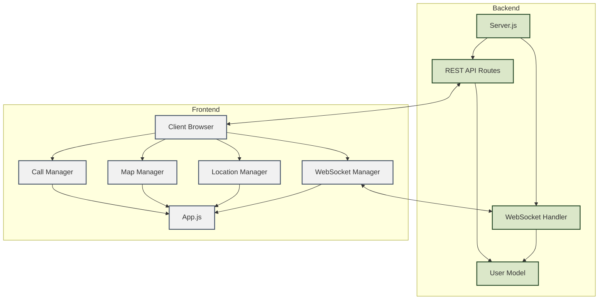
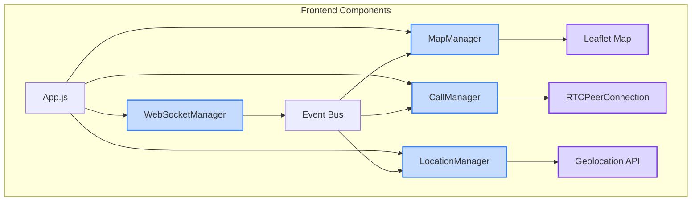
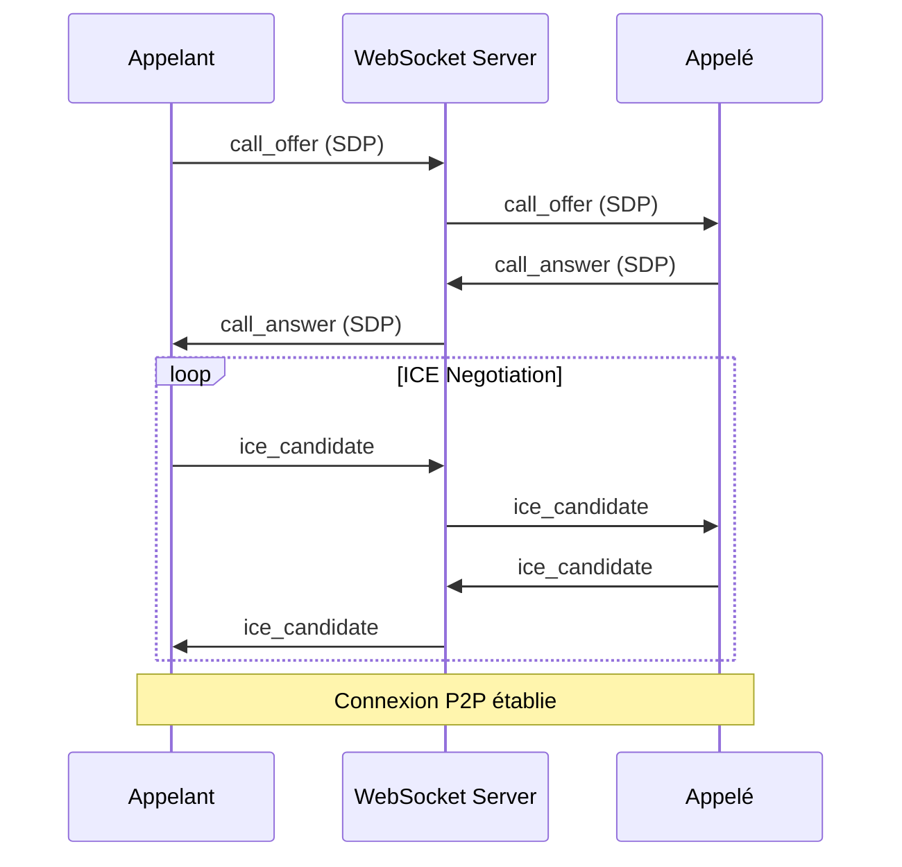

# Documentation Technique Détaillée

Application de Suivi en Temps Réel avec WebRTC

## Vue d'ensemble

### Description

Application web permettant le suivi géographique des utilisateurs en temps réel avec fonctionnalités d'appels vidéo peer-to-peer.

### Fonctionnalités principales

- Suivi géographique en temps réel
- Appels vidéo WebRTC
- Communication WebSocket
- Interface utilisateur responsive
- Gestion des utilisateurs
- Cartographie interactive

### Technologies utilisées

- **Backend**: Node.js, Express.js, WebSocket (ws)
- **Frontend**: HTML5, CSS3, JavaScript (ES6+)
- **API**: WebRTC, Geolocation API, WebSocket API
- **Cartographie**: Leaflet
- **Base de données**: In-memory (Map)

## Architecture

### Architecture générale



### Flux de données

- Le client se connecte et s'authentifie
- Le serveur WebSocket initie une connexion
- La géolocalisation démarre côté client
- Les positions sont diffusées via WebSocket
- Les appels vidéo sont établis en P2P via WebRTC


## Composants Backend

### User Model

- **Description**: Gestion des utilisateurs et de leurs positions.

***Méthodes***

```javascript
static getAllUsers()
static getUser(username)
static updateUser(username, data)
static deleteUser(username)
```

### WebSocket Handler

- **Description**: Gère les connexions WebSocket et les messages en temps réel.

***Types de messages***

- **init** : Initialisation de la connexion
- **position** : Mise à jour de la position
- **call_offer** : Offre d'appel WebRTC
- **call_answer** : Réponse à une offre d'appel
- **ice_candidate** : Candidat ICE pour connexion WebRTC
- **call_ended** : Fin d'appel


### REST API Routes

- **Description**: Interface REST pour la gestion des utilisateurs.

***Endpoints***

- **GET /api/users**
- **GET /api/users/:username**
- **PUT /api/users/:username**
- **DELETE /api/users/:username**

## Composants Frontend



### App.js

- **Description**: Point d'entrée de l'application frontend.

### Location Manager

- **Description**: Gestion de la géolocalisation côté client.

***Fonctionnalités***

- Suivi en temps réel de la position
- Gestion des erreurs de géolocalisation
- Calcul de la vitesse

### Map Manager

- **Description**: Gestion de la carte interactive Leaflet.

***Fonctionnalités***

- Affichage des utilisateurs sur la carte
- Mise à jour en temps réel des positions
- Popups d'informations
- Zoom et centrage automatique

### Call Manager

- **Description**: Gestion des appels vidéo WebRTC.

***États d'appel***

- **Initial**
- **Offre envoyée**
- **Offre reçue**
- **Connexion établie**
- **Appel en cours**
- **Appel terminé**



