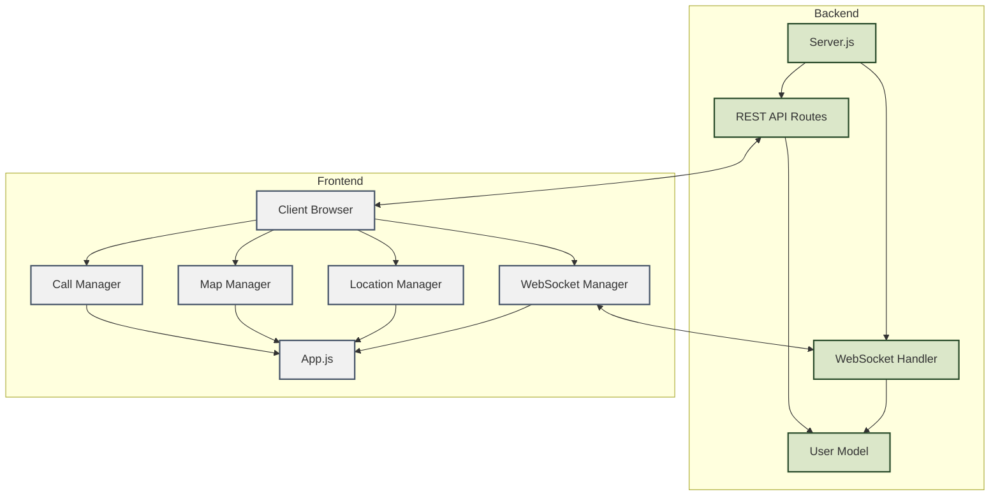

# Application de Suivi en Temps Réel avec WebRTC

Une application web permettant le suivi géographique des utilisateurs en temps réel avec possibilité d'appels vidéo.

## Fonctionnalités

- 🗺️ Suivi en temps réel sur carte interactive
- 📱 Géolocalisation native du navigateur
- 🎥 Appels vidéo peer-to-peer via WebRTC
- 🔄 Communication temps réel via WebSocket
- 📊 Interface utilisateur responsive

## Architecture



## Structure du Code

```
.
├── models/
│   └── userModel.js         # Gestion des données utilisateurs
├── public/
│   ├── css/
│   │   └── styles.css      # Styles de l'interface
│   ├── js/
│   │   ├── app.js          # Point d'entrée frontend
│   │   ├── callManager.js  # Gestion des appels WebRTC
│   │   ├── locationManager.js # Gestion géolocalisation
│   │   ├── mapManager.js   # Gestion carte Leaflet
│   │   └── websocketManager.js # Communication WebSocket
│   └── index.html          # Interface utilisateur
├── routes/
│   └── userRoutes.js       # Routes API REST
├── websocket/
│   └── wsHandler.js        # Gestionnaire WebSocket serveur
└── server.js  
```

### Détail des Composants

1. **server.js**
   - Point d'entrée de l'application
   - Configuration du serveur Express
   - Initialisation du serveur WebSocket
   - Gestion des fichiers statiques

2. **models/userModel.js**
   - Stockage des données utilisateurs en mémoire
   - Méthodes CRUD pour la gestion des utilisateurs
   - Format des données : username, latitude, longitude, speed

3. **websocket/wsHandler.js**
   - Gestion des connexions WebSocket
   - Traitement des messages en temps réel
   - Diffusion des mises à jour de position

4. **public/index.html**
   - Interface utilisateur
   - Carte interactive (Leaflet)
   - Logique de géolocalisation
   - Communication WebSocket côté client

## Technologies Utilisées

### Backend
- **Node.js** : Environnement d'exécution
- **Express.js** : Framework web
- **ws** : Bibliothèque WebSocket

### Frontend
- **HTML/CSS/JS** : Interface utilisateur
- **Leaflet** : Bibliothèque de cartographie
- **Géolocalisation API** : API native du navigateur
- **WebSocket API** : Communication en temps réel

## Exécution de l'Application

1. **Prérequis**
   ```bash
   # Installer Node.js
   ```

2. **Installation des dépendances**
   ```bash
   npm install express ws
   ```

3. **Lancement du serveur**
   ```bash
   node server.js
   ```

4. **Accès à l'application**
   - Ouvrir un navigateur
   - Accéder à `http://localhost:8080`
   - Autoriser la géolocalisation si demandé par le navigateur

5. **Démo de l'application**
   <video src="./videos/demo.mp4" width="100%" controls></video>
   

https://github.com/user-attachments/assets/11753435-4a1f-4694-8899-03be23556c1c


